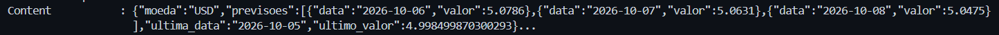
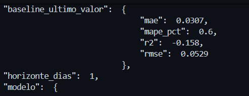
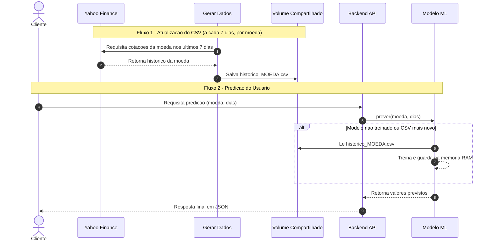
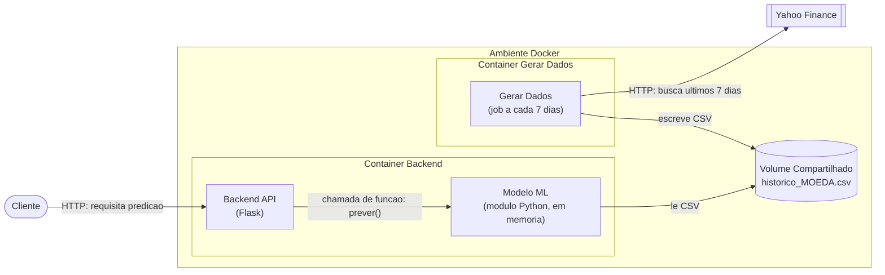

Markdown
# Dolar Requirement

Nome do Aluno: João Pedro Gonçalves Corrêa Araujo

## Sobre o Projeto

Descrição geral do projeto. Explique qual problema ele resolve, o contexto de desenvolvimento e os principais pontos de destaque da solução.


## Tecnologias Utilizadas

- **Linguagem:** [ex: TypeScript / Python / Go]
- **Framework:** [ex: React / Next.js / FastAPI / Express]
- **Banco de Dados:** [ex: PostgreSQL / MongoDB / Redis]
- **Infraestrutura / DevOps:** [ex: Docker / Vercel / AWS]

## Como Executar o Projeto

### Pré-requisitos

Certifique-se de ter as seguintes ferramentas instaladas em sua máquina:
- [Git](https://git-scm.com/)
- [Node.js](https://nodejs.org/) (versão X.X.X ou superior) / [Python](https://www.python.org/)

### Passo a Passo

1. **Clonar o repositório:**
   ```bash
   git clone https://github.com/seu-usuario/nome-do-repositorio.git
   ```

### Dev Log

- Etapa 1 - Criando base do repositório 
    - Primeiro passo foi estruturar a base do repositório e identificar como iniciar a estrutura e qual vai ser a base do meu projeto.
    - Para isso, identifiquei primeiro qual vai ser a estrutura base do meu projeto e resolvi dividir em três áreas diferentes, backend, modelo e gerar dados. O backend será responsável pegar conectar o usuário ao modelo através das rotas fazendo requisições de previsão e feito em flask já que é a biblioteca que tenho maior facilidade. O "gerar dados" será responsável por fazer buscas na API e gerar um novo CSV com histórico dos últimos 7 dias. E o modelo será responsável por realizar as previsões através dos dados buscados. Através disso, se torn possível gerar novos dados sem ter que subir um novo modelo.
    - Depois disso, percebi uma dificuldade, como salvar um novo csv gerado sem ter que subir um novo container. Eu sabia da existência dos volumes em docker, mas nunca tinha utilizado. Pedi para IA se era possível e como poderia realizar. Através dessa saída da IA, percebi que era possível e identifiquei um novo passo, criar um volume para subir o csv e o modelo conseguir consumir em tempo real.
    - Depois disso, como o tempo é curto, enviei a minha proposta para o Gemini para que ele conseguisse gerar um diagrama UML de sequência para mim da solução que eu havia desenhado. Depois, pedir para ele gerar o de componentes.
- Etapa 2 - API Finance e geração de csv
    - Depois disso, o próximo passo seria: Realizar a busca de dados. De novo, como o tempo é curto, pedi para a IA (Claude) gerar o código que gera um novo CSV. Defini que a API seria a do Yahoo Finance. 
    - A IA gerou o código mas veio com alguns problemas de prompt. Não pedi o dockerfile, mas ele já gerou. Quero cada etapa individual e que eu consiga ter controle do que ela estava fazendo. Então pedi para ela não fazer o dockerfile agora, isso será uma etapa posterior.
    - Lendo o código, o que foi gerado: uma função que busca cotações nos últimos 7 dias, mas isso está hardcoded, uma função que notifica o modelo que novos dados estão disponíveis através da rota do modelo. Uma para salvar o dataframe gerado em CSV, outra que executa um pipeline dessas funções e o clássico if de ao rodar o arquivo tudo é rodado.
    - Percebi também que a IA hardcodou a moeda, quero que isso seja passado pelo usuário, ou seja, pedi para ele arrumar e trocar para que a moeda seja alterável e não fixa em bitcoin por exemplo. Além disso, percebi que os dados estavam sendo localmente salvos em outra pasta do meu pc, fora de qualquer container, o que faz sentido já que um volume não pode estar salvo em um modelo.
- Etapa 3 - Geração do Modelo
    - Agora com os dados disponíveis, pedi para a IA gerar o modelo preditivo. Resolvi usar um modelo de Regressão Linear padrão com os dados para não ter complicações. O resultado por enquanto não importa, o mais importante é que tudo esteja rodando até o final da atividade, depois penso em qualidade do modelo e as feature
    - Como o volume não está deployado, a etapa de teste inicial vai ser local mesmo.
    - A IA gerou os códigos com rotas de API já integradas, mas isso é uma etapa separada, não deve ser feita simultâneamente ao modelo, então pedi para ela separar e não deixar rotas agora.
    - O código que a IA gerou ficou razoavel. Criou uma função que normaiza as moedas, outra que informa a caminho do CSV, está hardcoded e por enquanto não aponta para o volume, já que por enquanto ele não existe. Outra para treinar o modelo passando as colunas atuais do modelo e o Y previsto e outro para realizar uma previsão retornando a moeda, o último valor, a última datas e as previsões feitas pelo modelo.
- Etapa 4 - Criação do Backend
    - Agora com o modelo criado, o último passo é interligar tudo que foi criado através do backend da solução, conectando a parte de geração de dados e backend da solução.
    - Pedi para a IA criar o código do backend com aquilo que eu tinha desenhado através do UML da solução.
    - Ele criou com a rota padrão de health para saber se o modelo está no ar, um /moedas para ver as moedas que tem um csv salvo no volume criado. Outra rota foi o /historico/moeda que para pedir a parte de gerar dados para gerar um novo histórico de uma moeda. Também criou o /prever  {"moeda", "dias"} para pedir ao modelo prever.
    - Lendo o código, percebi um problema, a IA entendeu que a ambos ficariam no mesmo container e fez uma comunicação manual local via json. Pedi para ela refazer com os dois estando na mesma network de um compose e comunicação via HTTP padrão.
    - Pronto, o agora o modelo se comunica com o backend corretamente. 
- Etapa 5 - Criação do Docker
    - Agora que a base de todo o código já está criada, agora chegou a hora de subir os containers da aplicação. Todos rodam em python, então a base dos dockerfiles vai ser bem parecida.
    - Pedi para a IA gerar o código padrão do dockerfile, ambos rodando a mesma versão do python3.12 slim e o que mais mudam são as portas. 5000 para o backend e 5001 para o modelo.
    - Agora com os dockerfiles prontos, agora é só criar a solução e subir o compose em um mesmo network para comunicação.  
    - Gerando o dockercompose, percebi que a IA colocou as variáveis de ambiente dentro do docker compose, mas acredito que isso não é o correto. Vou fazer uma pesquisa para identificar se esse é o correto. Lendo, percebi que o .env é o comum para variáveis sensíveis, como não há nenhuma, mantive assim mesmo.
    - Depois disso, rodei o docker compose e subi os containers e estava tudo funcionando. Usei o docker compose up --build -d. 
- Etapa 6 - Etapa de Teste
    - Depois disso, usei um curl na rota prever com um intervalo de 3 dias, o modelo previu corretamente e estava tudo funcionando corretamente. 
    
    - Além disso, queria uma forma de testar o modelo sem ser através de executar um arquivo.py, então criei o GET de /metricas, para verificar as métricas do modelo, passando pelo modelo e pelo backend para que possa ser requisitado pelo usuário. Como é um modelo de regressão, as métricas usadas foram os erros do modelo, como MAE, MAPE, R², RMSE, todas as métricas aprendidas durante as aulas de computação durante esse módulo.
    - Subi o modelo com essa rota novamente usando um compose --build mas só com o modelo e a área de gerar dados e o novo container estava deployado,
    - Depois disso vi que as métricas do modelo estavam ruins. Com um MAPE de 0.6 e R² de -0.158. Então pedi para a IA me indicar possibilidades de melhoria do modelo, mas como o tempo estava curto, não apliquei nenhuma das alterações já que não teria tempo de validar as alterações da IA.
    
    - As saídas da IA, foram, tentar prever a variação, mas não era correto, já que o objetivo da atividade era prever o valor em si, então logo descartei. Outra ideia da IA foi usar atributos melhores, como usar médias móveis, mas não apliquei pelas outros motivos que já apresentei aqui.
- Etapa 7 - Próximos Passos
    - Como o tempo é curto, não pude melhorar o modelo como eu gostaria, por isso, defino como próximos passos seguir incrementando e melhorando o modelo preditivo. Utilizando talvez, uma maior janela de tempo e novas features.
    - Outra ponto interessante que eu gostaria de melhorar posteriormente, seria o re-treino do modelo, que ainda não existe na arquitetura atual do sistema. 


### Diagrama UML

#### Diagrama de Sequência



#### Diagrama de Componentes


