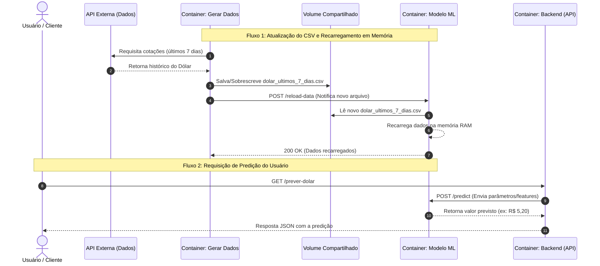

Markdown
# 🚀 Dolar Requirement

Nome do Aluno: João Pedro Gonçalves Corrêa Araujo

## 📌 Sobre o Projeto

Descrição geral do projeto. Explique qual problema ele resolve, o contexto de desenvolvimento e os principais pontos de destaque da solução.


## 🛠️ Tecnologias Utilizadas

- **Linguagem:** [ex: TypeScript / Python / Go]
- **Framework:** [ex: React / Next.js / FastAPI / Express]
- **Banco de Dados:** [ex: PostgreSQL / MongoDB / Redis]
- **Infraestrutura / DevOps:** [ex: Docker / Vercel / AWS]

---

## ⚙️ Como Executar o Projeto

### 📋 Pré-requisitos

Certifique-se de ter as seguintes ferramentas instaladas em sua máquina:
- [Git](https://git-scm.com/)
- [Node.js](https://nodejs.org/) (versão X.X.X ou superior) / [Python](https://www.python.org/)

### 🚀 Passo a Passo

1. **Clonar o repositório:**
   ```bash
   git clone [https://github.com/seu-usuario/nome-do-repositorio.git](https://github.com

### Dev Log

- Etapa 1 - Criando base do repositório 
    - Primeiro passo foi estruturar a base do repositório e identificar como iniciar a estrutura e qual vai ser a base do meu projeto.
    - Para isso, identifiquei primeiro qual vai ser a estrutura base do meu projeto e resolvi dividir em três áreas diferentes, backend, modelo e gerar dados. O backend será responsável pegar conectar o usuário ao modelo através das rotas fazendo requisições de previsão e feito em flask já que é a biblioteca que tenho maior facilidade. O "gerar dados" será responsável por fazer buscas na API e gerar um novo CSV com histórico dos últimos 7 dias a cada 7 dias. E o modelo será responsável por realizar as previsões através dos dados buscados. Através disso, se torn possível gerar novos dados sem ter que subir um novo modelo.
    - Depois disso, percebi uma dificuldade, como salvar um novo csv gerado sem ter que subir um novo container. Eu sabia da existência dos volumes em docker, mas nunca tinha utilizado. Pedi para IA se era possível e como poderia realizar. Através dessa saída da IA, percebi que era possível e identifiquei um novo passo, criar um volume para subir o csv e o modelo conseguir consumir em tempo real.
    - Depois disso, como o tempo é curto, enviei a minha proposta para IA para que ela conseguisse gerar um diagrama UML de sequência para mim da solução que eu havia desenhado.
- Etapa 2 - API Finance e geração de csv
    - Depois disso, o próximo passo seria: Realizar a busca de dad

### Diagrama UML

#### Diagrama de Sequência

